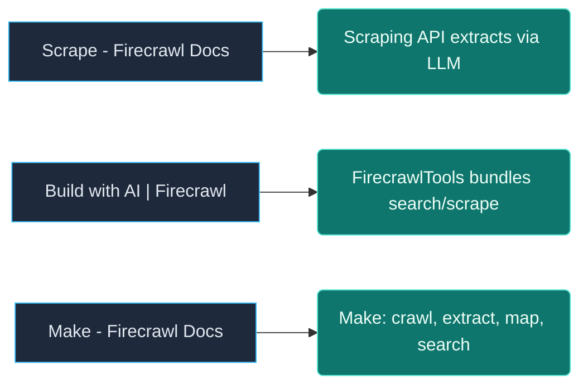

# 🐝 research-swarm

**Multi-agent research that actually finishes.**

Give it a goal → a LangGraph supervisor routes **Discovery → Gatherer → Extractor → Verifier → Synthesizer** → you get a **cited markdown report** from the live web via [Firecrawl](https://github.com/firecrawl/firecrawl).

[](https://github.com/bg-playground/research-swarm/actions/workflows/ci.yml)
[](https://www.python.org/downloads/)
[](LICENSE)

```text
  goal ──► supervisor ──┬── discovery   (Firecrawl Search)
                        ├── gatherer    (parallel scrape + retry)
                        ├── extractor   (structured facts)
                        ├── verifier    (conflicts / quality)
                        └── synthesizer ──► cited report
```

---

## Why this exists

Most “research agents” are either a single ReAct loop that drifts, or a heavy framework that’s hard to read.

**research-swarm** stays small and explicit:

| | |
|---|---|
| **Good for** | Competitive intel, product / landscape research, docs deep-dives, source-backed briefings |
| **Not for** | Bulk site scraping, authenticated browser flows (yet), long-running monitors |

Resilience is built in: circuit breaker, rate-limit backoff, gatherer retry, concurrency cap (5 scrapes/turn), disk URL cache, and claim–evidence pairing.

---

## Quick start

```bash
git clone https://github.com/bg-playground/research-swarm.git
cd research-swarm
python -m venv .venv
source .venv/bin/activate          # Windows: .venv\Scripts\activate
pip install -e .

cp .env.example .env
# Set OPENAI_API_KEY and FIRECRAWL_API_KEY

python -m src.main --check
python -m src.main "Summarize core Firecrawl API concepts from docs.firecrawl.dev for agent builders"
```

Or after install: `research-swarm "Your research goal"` · `research-swarm --help`

---

## Example goals

| Example | Try |
|---------|-----|
| [Competitor pricing](examples/01_competitor_pricing.md) | `python -m src.main "Compare Firecrawl and traditional scrapers for LLM agents"` |
| [OSS landscape](examples/02_oss_landscape.md) | `python -m src.main "Map open-source web data APIs aimed at AI agents"` |
| [Docs deep-dive](examples/03_docs_deep_dive.md) | `python -m src.main "From docs.firecrawl.dev, summarize search, scrape, crawl, map, interact"` |

---

## What a run looks like

```text
research-swarm
========================================================
  Goal From docs.firecrawl.dev, summarize search, scrape, crawl…
  Max iterations 8
========================================================
  discovery  → 8 ranked sources (query rewrite + domain priors)
  gatherer   → 5 scraped (cache hits on re-runs)
  extractor  → grounded facts with evidence quotes
  gatherer   → remaining sources
  extractor  → incremental facts only
  synthesizer → cited report + citation graph
--------------------------------------------------------
  [completed] | 7 iterations | 8 sources | 9 facts | 0 conflicts
```

Reports are markdown: executive summary, **key findings with evidence**, gaps, sources, and a **Mermaid citation graph**.

---

## Example output (excerpt)

Goal: *From docs.firecrawl.dev, summarize search, scrape, crawl, map, and interact for AI agent builders*

**Key finding (grounded):**

> **Scraping API** — Firecrawl offers a scrape endpoint for a single URL with optional LLM extraction.  
> Evidence: *"Scrape a single URL and optionally extract information using an LLM."*  
> Source: [docs.firecrawl.dev/api-reference/endpoint/scrape](https://docs.firecrawl.dev/api-reference/endpoint/scrape)

**Citation graph** (auto-appended to every report; renders on GitHub):



Dark boxes = sources · Teal nodes = grounded facts linked by URL.

---

## Configuration

| Variable | Required | Notes |
|----------|----------|--------|
| `OPENAI_API_KEY` | Yes | Supervisor / extractor / synthesizer |
| `FIRECRAWL_API_KEY` | Yes | Live search & scrape |
| `FIRECRAWL_API_URL` | No | Self-hosted Firecrawl |
| `RESEARCH_SWARM_MODEL` | No | Default `gpt-4o-mini` |
| `RESEARCH_SWARM_TEMPERATURE` | No | Default `0` |
| `RESEARCH_SWARM_LOG_LEVEL` | No | `DEBUG` / `INFO` / … |
| `RESEARCH_SWARM_CACHE_TTL_HOURS` | No | Scrape cache TTL (default `24`) |
| `RESEARCH_SWARM_CACHE_DISABLED` | No | Set `1` to disable disk cache |
| `LANGCHAIN_TRACING_V2` | No | Set `true` + `LANGCHAIN_API_KEY` for LangSmith |

---

## Project layout

```text
src/
├── graph.py · state.py · main.py · config.py
├── tools/firecrawl_tools.py
├── utils/circuit_breaker · url_cache · citation_graph · logging
└── agents/  supervisor · discovery · gatherer · extractor · verifier · synthesizer
examples/   01_competitor_pricing · 02_oss_landscape · 03_docs_deep_dive
tests/      smoke tests (no API keys required)
```

```bash
pip install -e ".[dev]" && pytest tests/ -v
```

---

## Responsible use

Respect site terms and `robots.txt`. Rate-limit backoff, concurrency caps, and the circuit breaker exist to reduce load — don’t strip them for aggressive crawling. Built for research and synthesis, not bulk harvesting.

---

## Author

<p align="center">
  
</p>

Built by **Brad Guider** — Independent Automation Engineer, Graph Architect, OSINT Synthesizer and creator of [NAT Testing](https://nat-testing.io) (AI-powered, Neural Based, Accessibility & Full-Stack Testing Platform), BGSTM Software Test Methodology and BGAEM Agent Engineering Methodology.

- Portfolio: [bradguider.com](https://bradguider.com)
- X: [@GuiderBrad](https://x.com/GuiderBrad)
- NAT Testing: [nat-testing.io](https://nat-testing.io)

---

## License

MIT
